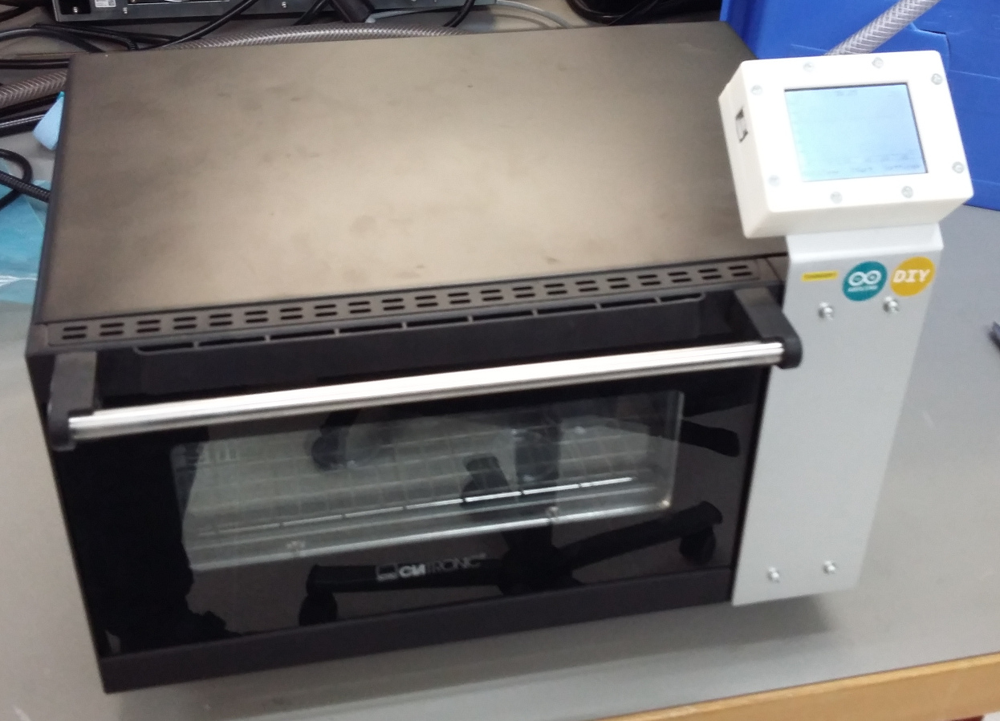
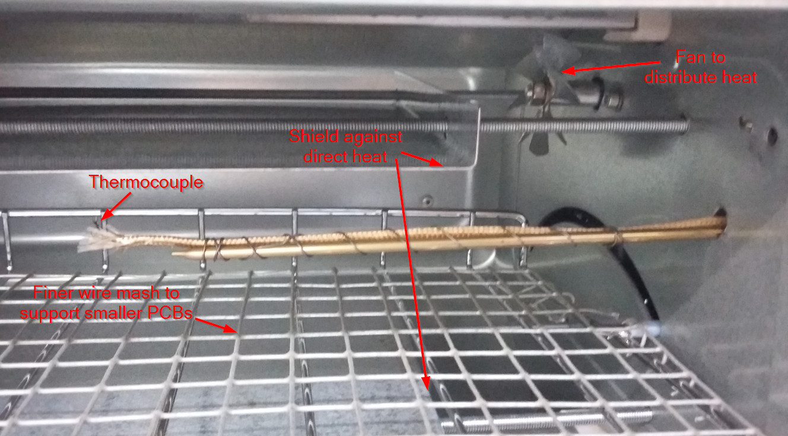
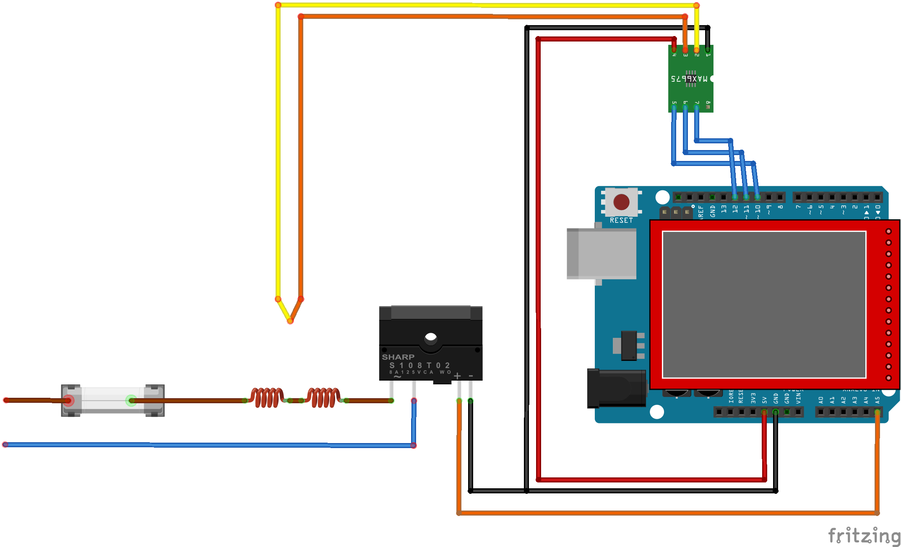

# Arduino-Reflow-Oven
This device controls a pizza oven to produce temperature ramps to use it as a [reflow oven](https://en.wikipedia.org/wiki/Reflow_oven). Therefore
several simple modifications are done. The builtin control is disconnected and the heater is controlled
through an opto-SSR (optocoupled solid state relay).

This reflow oven can therefore be used to produce a variety of temperature profiles - not only for reflow
soldering.

| The reflow oven | The Inside of the reflow oven |
| :--- | :--- |
|   |  |

## What is a reflow oven used to
To populate PCBs width components you could either use a soldering iron and solder each component by hand
or you can use a reflow oven. To use a reflow oven you put soldering paste onto the pads and put your
components on top. The you bake it in an oven - a reflow oven. The special functionality of a reflow oven
is that you can produce temperature profiles. This is to solder the components as gently as possible but
also guarantee good solder joints.

## Requirements
* [Arduino IDE](https://www.arduino.cc/en/main/software)
* Adafruit_GFX library (V1.5.0, newer libraries generate error according textsize)
* SWTFT Library
* TouchScreen Library
* MAX6675 Library
* TimerOne Library
* [Visual Studio](https://visualstudio.microsoft.com/) to have a comfortable IDE
* [Visual Micro](https://www.visualmicro.com/) to integrate Arduino IDE in Visual Studio

## Hardware
The hardware consists of:
* [Pizza oven Clatronic MPO 3520](https://www.clatronic.de/products/de/Elektro-Kleingeraete/Kleine-Backoefen/MPO-3520-Multi-Pizza-Ofen.html)
* [Arduino Uno](https://store.arduino.cc/arduino-uno-rev3)
* 2.4" 240x320 TFT display shield with integrated touch ([search for "2.4 TFT"](https://www.aliexpress.com/w/wholesale-2.4-TFT.html) and check for ST7781 or SPFD5408 driver chip)
* [Opto-SSR S202S02 / S202SE2](https://www.aliexpress.com/item/S202S02/32364561514.html)
* [MAX6675 thermocouple module with thermocouple sensor](https://www.aliexpress.com/item/2pcs-lot-MAX6675-K-type-Thermocouple-Temperature-Sensor-Temperature-0-800-Degrees-Module-Free-Shipping-Dropshipping/1843169664.html)

## Software
Depending on the display used you have to uncomment the right definition (`USE_ST7781` or `USE_SPFD5408`) in the file `ReflowOven.h`
or extend the code in `Display.cpp` to use the right driver class for the `tft` object.

## Housing / Enclosure
The housing for the Arduino Uno and the TFT-Touch-Screen is printed using a 3D-Printer and mounted with a
piece of aluminium to the oven.

## Author
[Marco Graf](https://github.com/grafmar)  
Roman Scheuss

## Credits / Attribution
Roman Scheuss built this device and programmed the first version of the arduino code.
